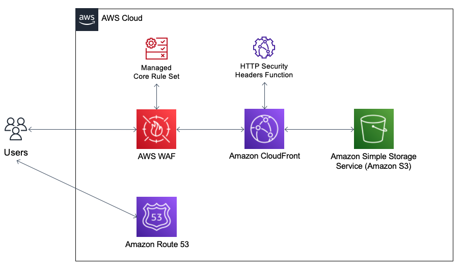

# Deploy Secure Static Web Apps on AWS

## Summary

Securing static web apps is a complex challenge for many organizations. While there is no one size fits all approach, there are services and features within AWS that you can utilize to get a head start on your web app security journey. AWS WAF (Web Application Firewall) can protect your web app against bots that may compromise security or consume excessive resources. Additionally, Amazon CloudFront Functions can add HTTP security headers that limit requests from the client. This APG provides an AWS Cloud Development Kit (CDK) construct with secure defaults to simplify the infrastructure for a secure static web app. The construct uses Amazon S3, Amazon CloudFront, AWS WAF, and Amazon Route 53.

See the associated [Amazon Prescriptive Guidance (APG) Pattern](https://apg-library.amazonaws.com/content/9ed9140c-a1d6-49ac-8aba-8bd533fa4ce2) for further information.

## Prerequisites

- Node.js installed. For more information, see [Node.js Downloads](https://nodejs.org/en/download/).
- PNPM installed. For more information, see [PNPM Installation](https://pnpm.io/installation).
- AWS Cloud Development Kit (CDK) Toolkit, installed and configured. For more information, see [AWS CDK Toolkit (cdk command)](https://docs.aws.amazon.com/cdk/latest/guide/cli.html).
- An AWS Account bootstrapped with the AWS CDK. For more information, see [Bootstrapping](https://docs.aws.amazon.com/cdk/latest/guide/bootstrapping.html).
- If enabling Amazon Route 53, a hosted zone with your domain name must already exist in your account. For more information, see **Setup Route 53 Epic** below.
- Git, installed and configured. For more information, see [Git](https://git-scm.com/).

## Limitations

- If enabling AWS WAF or Amazon Route 53, then you must deploy your stack in the **Region US East (N. Virginia)** in order to associate them with your CloudFront distribution. For more information, see [AWS WAF Developer Guide](https://docs.aws.amazon.com/waf/latest/developerguide/how-aws-waf-works.html) and [Amazon Route 53 Developer Guide](https://docs.aws.amazon.com/Route53/latest/DeveloperGuide/getting-started-cloudfront-overview.html#getting-started-cloudfront-request-certificate).

## Product versions

- AWS CLI Version 2 or greater
- Node.js 14.X or greater
- PNPM 6.X or greater
- AWS CDK v2 or greater
- Git 2.X or greater

## Architecture



## Tools

- [Node.js](https://nodejs.org/en/)
- [AWS CDK](https://aws.amazon.com/cdk/)

## Epics

### Clone Repository and Deploy Infrastructure

|Story|Description|Skills required|
|-|-|-|
|Clone Repository|Clone the repository from https://github.com/aws-samples/secure-static-site and install dependencies.<br/><br/>```git clone https://github.com/aws-samples/secure-static-site.git```<br/>```cd secure-static-site```<br/>```pnpm install```|App developer|
|Deploy Infrastructure|Deploy the infrastructure defined by the CDK in the secure-static-site-frontend package. This package uses the construct defined in the secure-static-site package.<br/><br/>```cd secure-static-site-frontend```<br/>```cdk deploy```<br/>```# after reviewing security changes, remember to enter y```<br/><br/>Note, if you run into error about your AWS Account not being boostrapped for the CDK, make sure to review the prerequisites.|App developer|

### Validate HTTP Security Headers

|Story|Description|Skills required|
|-|-|-|
|Validate scrip-src CSP|First, visit the URL of either your Route 53 or CloudFront domain and click the "Download" button for the "Script" content type to validate the script-src CSP. The download of the script should be blocked. You can check for yourself by looking at the Network tab of your browser's developer tools. Update the construction of your StaticSite in packages/secure-static-site-frontend/bin/static-site.ts to the following:<br/><br/><pre>// packages/secure-static-site-frontend/bin/static-site.ts<br/>const staticSite = new StaticSite(this, "SecureStaticSite", {<br/>&nbsp;&nbsp;...<br/>&nbsp;&nbsp;responseHeaders: {<br/>&nbsp;&nbsp;&nbsp;&nbsp;contentSecurityPolicy: {<br/>&nbsp;&nbsp;&nbsp;&nbsp;&nbsp;&nbsp;scriptSrc: "self https://unpkg.com/react@17/umd/react.production.min.js;",<br/>&nbsp;&nbsp;&nbsp;&nbsp;&nbsp;&nbsp;...<br/>&nbsp;&nbsp;&nbsp;&nbsp;},<br/>&nbsp;&nbsp;},<br/>&nbsp;&nbsp;...<br/>});</pre>Now run ```cdk deploy```, refresh your browser, and try again. You should get a 200 HTTP status code indicating a successful download of the request.|App developer|
|Validate style-src CSP|Next click the "Download" button for the "Style" content type to validate the style-src CSP. The download should be blocked. Update the construction of your StaticSite in packages/secure-static-site-frontend/bin/static-site.ts to the following:<br/><br/><pre>// packages/secure-static-site-frontend/bin/static-site.ts<br/>const staticSite = new StaticSite(this, "SecureStaticSite", {<br/>&nbsp;&nbsp;...<br/>&nbsp;&nbsp;responseHeaders: {<br/>&nbsp;&nbsp;&nbsp;&nbsp;contentSecurityPolicy: {<br/>&nbsp;&nbsp;&nbsp;&nbsp;&nbsp;&nbsp;styleSrc: "'self' 'sha256-47DEQpj8HBSa+/TImW+5JCeuQeRkm5NMpJWZG3hSuFU=' https://unpkg.com/tailwindcss@^2/dist/tailwind.min.css;",",<br/>&nbsp;&nbsp;&nbsp;&nbsp;&nbsp;&nbsp;...<br/>&nbsp;&nbsp;&nbsp;&nbsp;},<br/>&nbsp;&nbsp;},<br/>&nbsp;&nbsp;...<br/>});</pre>Then run ```cdk deploy```, refresh your browser, and try again. The download should now be successful.|App developer|
|Validate font-src CSP|Next click the "Download" button for the "Font" content type to validate the font-src CSP. The download should be blocked. Update the construction of your StaticSite in packages/secure-static-site-frontend/bin/static-site.ts to the following:<br/><br/><pre>// packages/secure-static-site-frontend/bin/static-site.ts<br/>const staticSite = new StaticSite(this, "SecureStaticSite", {<br/>&nbsp;&nbsp;...<br/>&nbsp;&nbsp;responseHeaders: {<br/>&nbsp;&nbsp;&nbsp;&nbsp;contentSecurityPolicy: {<br/>&nbsp;&nbsp;&nbsp;&nbsp;&nbsp;&nbsp;fontSrc: "'self' data: https://fonts.googleapis.com/css?family=Roboto:300,400,500,700&display=swap;",<br/>&nbsp;&nbsp;&nbsp;&nbsp;&nbsp;&nbsp;...<br/>&nbsp;&nbsp;&nbsp;&nbsp;},<br/>&nbsp;&nbsp;},<br/>&nbsp;&nbsp;...<br/>});</pre>Then run ```cdk deploy```, refresh your browser, and try again. The download should now be successful.|App developer|
|Validate img-src CSP|Next click the "Download" button for the "Image" content type to validate the font-src CSP. The download should be successful. The StaticSite construct's default policy is to allow images to be downloaded from it's own origin which is the case for the StaticSiteArchitecture.png image. If an image were to try to be downloaded from a different origin, then the request would of been blocked.|App developer|
|Validate media-src CSP|Next click the "Download" button for the "Media" content type to validate the media-src CSP. The download should be blocked. Update the construction of your StaticSite in packages/secure-static-site-frontend/bin/static-site.ts to the following:<br/><br/><pre>// packages/secure-static-site-frontend/bin/static-site.ts<br/>const staticSite = new StaticSite(this, "SecureStaticSite", {<br/>&nbsp;&nbsp;...<br/>&nbsp;&nbsp;responseHeaders: {<br/>&nbsp;&nbsp;&nbsp;&nbsp;contentSecurityPolicy: {<br/>&nbsp;&nbsp;&nbsp;&nbsp;&nbsp;&nbsp;mediaSrc: "'self'",<br/>&nbsp;&nbsp;&nbsp;&nbsp;&nbsp;&nbsp;...<br/>&nbsp;&nbsp;&nbsp;&nbsp;},<br/>&nbsp;&nbsp;},<br/>&nbsp;&nbsp;...<br/>});</pre>Then run ```cdk deploy```, refresh your browser, and try again. The download should now be successful.|App developer|

### Enable AWS WAF and Validate Rules

|Story|Description|Skills required|
|-|-|-|
|Enable WAF with defaults|Enable the StaticSite prop enableWaf and set it's value to true in order to protect your CloudFront distribution with the AWS WAF service, including the following AWS managed rule groups by default:<br/><br/><ul><li>Core rule set (CRS)</li><li>Anonymous IP list</li><li>AWS WAF Bot Control</li></ul>You can find detailed descriptions of these rule groups in the AWS WAF Developer Guide.<br/><br/><pre>const staticSite = new StaticSite(this, "SecureStaticSite", {<br/>&nbsp;&nbsp;...<br/>&nbsp;&nbsp;enableWaf: true,<br/>&nbsp;&nbsp;...<br/>});</pre>|App developer|
|Enable WAF metrics (optional)|If you want view metrics tracking which users were allowed to access and which were blocked from accessing your distribution, including the reason why they were blocked, then also enable the prop enableWafMetrics and set it's value to true.<br/><br/><pre>const staticSite = new StaticSite(this, "SecureStaticSite", {<br/>&nbsp;&nbsp;...<br/>&nbsp;&nbsp;enableWafMetrics: true,<br/>&nbsp;&nbsp;...<br/>});</pre>These metrics are easily viewable from the WAF Console.|App developer|
|Validate Core Rule Set (optional)|***Note: you must have curl installed to complete this story.***<br/><br/>You can use the curl command line tool to validate that the Core Rule Set is activated. First, enter the following command in your terminal:<br/><br/>```curl <insert CloudFront distribution URL>```<br/><br/>Replace ***\<insert CloudFront distribution URL>*** with the actual URL, and then press enter to run the command. You should see something like this:<br/><br/><pre>\<!DOCTYPE html><br/>\<html lang="en"><br/>&nbsp;&nbsp;\<head><br/>&nbsp;&nbsp;&nbsp;&nbsp;\<meta charset="UTF-8" /><br/>&nbsp;&nbsp;&nbsp;&nbsp;\<link rel="icon" type="image/svg+xml" href="/assets/favicon.17e50649.svg" /><br/>&nbsp;&nbsp;&nbsp;&nbsp;\<meta name="viewport" content="width=device-width, initial-scale=1.0" /><br/>&nbsp;&nbsp;&nbsp;&nbsp;\<title>Secure Static Site</title><br/>&nbsp;&nbsp;&nbsp;&nbsp;\<script type="module" crossorigin src="/assets/index.64efc456.js"></script><br/>&nbsp;&nbsp;&nbsp;&nbsp;\<link rel="modulepreload" href="/assets/vendor.4a91ef1a.js"><br/>&nbsp;&nbsp;&nbsp;&nbsp;\<link rel="stylesheet" href="/assets/index.08bade3f.css"><br/>&nbsp;&nbsp;\</head><br/>&nbsp;&nbsp;\<body><br/>&nbsp;&nbsp;&nbsp;&nbsp;\<div id="root"></div><br/><br/>&nbsp;&nbsp;\</body><br/>\</html></pre>This response is just the root HTML code for the site, but it demonstrates that the command completed successfully.<br/><br/>Now let's try again, but this time we will add an HTTP header that will trigger the Core Rule Set Rule Group and block our request. We will be supplying a User-Agent header with a blank value, which is not allowed according to rule NoUserAgent_HEADER. The command will now be the following:<br/><br/>```curl <insert CloudFront distribution URL> -H 'User-Agent:'```<br/><br/>Once you run this command, you should get an HTML error message back similar to this:<br/><br/><pre>\<!DOCTYPE HTML PUBLIC "-//W3C//DTD HTML 4.01 Transitional//EN" "http://www.w3.org/TR/html4/loose.dtd"><br/>\<HTML><HEAD><META HTTP-EQUIV="Content-Type" CONTENT="text/html; charset=iso-8859-1"><br/>\<TITLE>ERROR: The request could not be satisfied</TITLE><br/>\</HEAD><BODY><br/>\<H1>403 ERROR</H1><br/>\<H2>The request could not be satisfied.</H2><br/>\<HR noshade size="1px"><br/>Request blocked.<br/>We can't connect to the server for this app or website at this time. There might be too much traffic or a configuration error. Try again later, or contact theapp <br/>or website owner.<br/>\<BR clear="all"><br/>If you provide content to customers through CloudFront, you can find steps to troubleshoot and help prevent this error by reviewing the CloudFront documentation.<br/>\<BR clear="all"><br/>\<HR noshade size="1px"><br/>\<PRE><br/>Generated by cloudfront (CloudFront)<br/>Request ID: Z37Crk-Vlz7xj0jWdjEIFjd02vBgWXL2wN6m47WtjQ-h3iDUFFSILA==<br/>\</PRE><br/>\<ADDRESS><br/>\</ADDRESS><br/>\</BODY>\</HTML></pre>There are additional rules like this one included in the Core Rule Set, each of which will block requests that match their criteria for security violations. You can find more information on which rules are included in the [AWS WAF Developer Guide](https://docs.aws.amazon.com/waf/latest/developerguide/aws-managed-rule-groups-list.html).|App developer|
|Restrict access to allowed IP list (optional)|If you only want to allow certain IP addresses to access your site, then you can create a list of allowed IP addresses using the prop allowedIPs. The list values should be strings in CIDR format, for example:<br/><br/><pre>const staticSite = new StaticSite(this, "SecureStaticSite", {<br/>&nbsp;&nbsp;...<br/>&nbsp;&nbsp;allowedIPs: ["10.0.0.0/16", "10.1.1.0/24", "10.1.2.20/32"],<br/>&nbsp;&nbsp;...<br/>});</pre>In order to test that this rule is working you can start with an empty list, which will block everyone since only IPs included in the list are allowed.<br/><br/>Once you validate that you are being blocked by this rule when the list is empty, try adding your IP address to the list with "/32" at the end to signify that this is a single address. You can find your IP address by going to the site http://checkip.amazonaws.com/. Now validate that you are once again able to access your site.<br/><br/>***For fun, you can also try accessing the site from your phone with WiFi turned off. Since your IP address will be different and it is not included in the allowed list, you will be blocked!***<br/><br/>If you have WAF metrics enabled, then you can view these access attempts in the WAF Console.|App developer|
|Disable specific default rule groups (optional)|Although we enable some AWS managed rule groups by default, you have the option to disable any of them. For example:<br/><br/><pre>const staticSite = new StaticSite(this, "SecureStaticSite", {<br/>&nbsp;&nbsp;...<br/>&nbsp;&nbsp;disableCoreWafRuleGroup: true,<br/>&nbsp;&nbsp;disableAmazonIPWafRuleGroup: false,<br/>&nbsp;&nbsp;disableAnonymousIPWafRuleGroup: false,<br/>&nbsp;&nbsp;...<br/>});</pre>This configuration will disable the Core Rule Set, but leave the other groups enabled.<br/><br/>***Note: you can exclude the prop entirely if you don't want to disable it, rather than including it and setting the value to false.***|App developer|

### Setup Route 53 (Optional)

|Story|Description|Skills required|
|-|-|-|
|Register new domain with Route 53|***(Skip if you already have a domain registered with Route 53 and a corresponding hosted zone)***<br/><br/>Register a new domain in Route 53, which will automatically create a hosted zone associated the that domain. Follow the instructions from the [Amazon Route 53 Developer Guide](https://docs.aws.amazon.com/Route53/latest/DeveloperGuide/domain-register.html).<br/><br/>***Note: In most situations you can stop after step 10. Steps 11-14 may apply to some users, but always skip step 15.***|App owner|
|Add domain name base and prefix to CDK|Add domainNameBase and domainNamePrefix to the StaticSite construct's props. Enter the name of your domain/hosted zone as domainNameBase and the desired prefix for your static site as domainNamePrefix (e.g. secure-static-site.mybasedomain.com). A prefix is specified so that multiple sites can use the same base domain you registered with Route 53.<br/><br/>***Note: This construct requires both a base and prefix if enabling Route 53.***<br/><br/><pre>// packages/secure-static-site-frontend/bin/static-site.ts<br/>const staticSite = new StaticSite(this, "SecureStaticSite", {<br/>&nbsp;&nbsp;...<br/>&nbsp;&nbsp;domainNameBase: "mybasedomain.com",<br/>&nbsp;&nbsp;domainNamePrefix: "secure-static-site",<br/>&nbsp;&nbsp;...<br/>});</pre>|App developer|

## Related resources

- [Amazon S3 + Amazon CloudFront: A Match Made in the Cloud](https://aws.amazon.com/blogs/networking-and-content-delivery/amazon-s3-amazon-cloudfront-a-match-made-in-the-cloud/)
- [Mozilla Developer Network: Content Security Policy](https://developer.mozilla.org/en-US/docs/Web/HTTP/CSP)

## Security

See [CONTRIBUTING](CONTRIBUTING.md#security-issue-notifications) for more information.

## License

This library is licensed under the MIT-0 License. See the LICENSE file.

